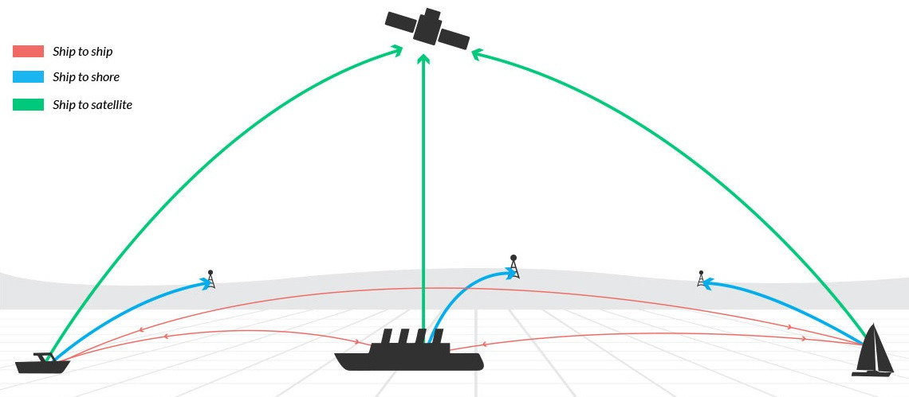

# 🚢 Real-Time AIS Tracking System
A **real-time maritime tracking system** that simulates **AIS (Automatic Identification System) data**, validates it, and processes it using **Kafka, PostgreSQL (PostGIS), and Docker**.

---

## 📌 How Does AIS Work?
AIS is an **automatic tracking system** used by ships to broadcast:
- **Position (latitude/longitude)**
- **Speed & course**
- **Heading & destination**
- **MMSI (unique ship ID)**

AIS data is received by **terrestrial stations & satellites** and used for **real-time vessel tracking**.



---

## 📦 System Architecture
### 💡 Overview
This system simulates real-time AIS data, streams it using **Kafka**, processes it with **Python services**, and stores it in **PostGIS** for further analytics.


### 🛠️ Technologies Used
| Component        | Tech Stack          | Purpose |
|-----------------|--------------------|---------|
| **Messaging**   | Kafka, Zookeeper   | Stream AIS data |
| **Storage**     | PostgreSQL + PostGIS | Store ship positions |
| **Processing**  | Python, Kafka Consumers | Validate & enrich AIS data |
| **Containerization** | Docker, Docker Compose | Run the system in containers |
| **Visualization** | Elasticsearch (Future) | Real-time dashboards |

---


## 📌 System Components
### 1️⃣ Kafka Topics
| **Topic Name**   | **Purpose** |
|----------------|------------|
| `ais.raw.data`  | Raw AIS messages from ships |
| `ais.valid.data` | Valid AIS messages |
| `ais.bad.data`   | Faulty or missing AIS data |

### 2️⃣ Services
| **Service**      | **Function** |
|----------------|-------------|
| `ais-producer.py` | Generates & streams AIS data to Kafka |
| `ais-validator.py` | Filters invalid AIS data |
| `ais-db-consumer.py` | Stores valid AIS data in PostgreSQL |

---


## 🚀 Getting Started
### 1️⃣ Clone the Repository
```bash
git clone https://github.com/labibmnsr/ais-tracking.git
cd ais-tracking
```

## 👨‍💻 Contributing
1. Fork the repo
2. Create a new branch (git checkout -b feature-xyz)
3. Commit your changes (git commit -m "Added xyz feature")
4. Push to the branch (git push origin feature-xyz)
5. Open a pull request!
